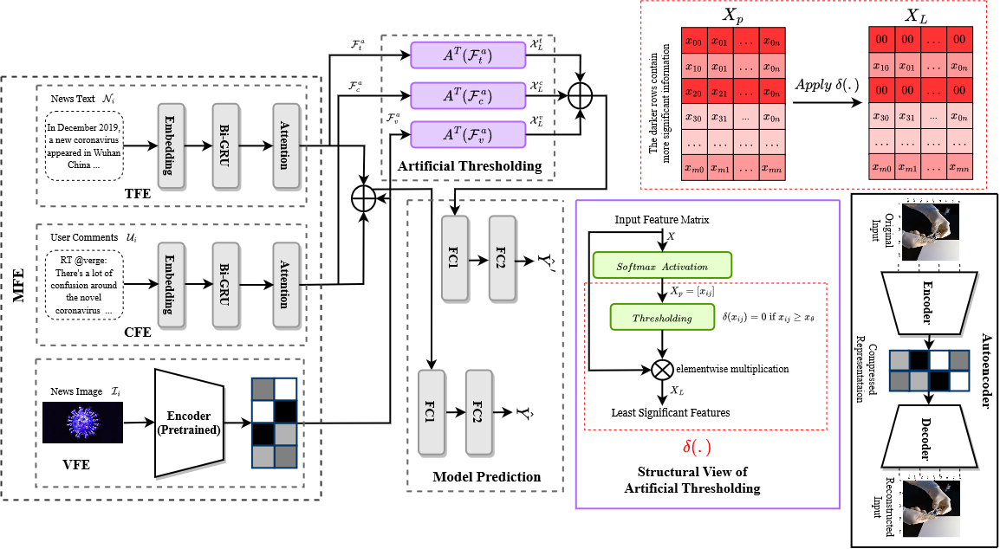

# mEXACT: Exploring a New Facet of Explainability for Multimodal Misinformation Detection 
## Introduction
mEXACT finds a variable-size bucket of check-worthy information whose removal from a false input sample can invert its semantics. Consequently, the proposed model is capable of distinguishing contributing and non-contributing misinformation elements for better explainability along with outperforming the existing models over classification performance.

## Installation

### Prerequisite
----------------------
Python >= 3.6.
Anaconda 3

### Create Environment
Type the following command to create the environment "mexact" which contains all the required packages. \\
conda env create -f mexact.yml

-----------------------

## Details

### Details of getData.py
 * This python script first prepare the data for news text, user comments and news images.
 * Next, it invokes build_NeuralNet() function of another script getModel.py to compile our neural network model.
 * Execute "getData.py" file to initite the training process.
 * After model training is done, save the trained model.
 * Required files will be saved under "repo_Fast" folder.
   
### Details of getModel.py
 * This file contains the main DNN model mEXACT.
 * mEXACT first extracts encodede representation of news text, user comments and news image.
 * Next, mEXACT invokes artificialThresholding() function to retain the LS features in the encodede representation of news text, user comments and news image.
   
### Details of getData_Explainability.py
 * This python script also prepares the data for news text, user comments and news images.
 * Next, it loads the already saved trained mEXACR model.
 * Finally, this script stores the explainable and non-explainable components of news text, user comments and news image by analyzing the MS and LS information. 

## mEXACT Framework

