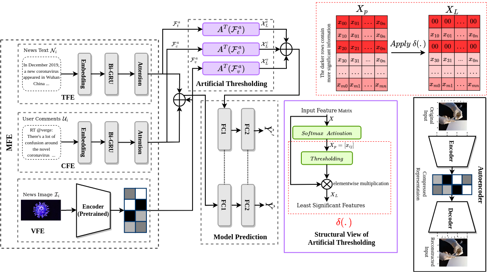

# mEXACT: Exploring a New Facet of Explainability for Multimodal Misinformation Detection 
## Introduction
mEXACT finds a variable-size bucket of check-worthy information whose removal from a false input sample can invert its semantics. Consequently, the proposed model is capable of distinguishing contributing and non-contributing misinformation elements for better explainability along with outperforming the existing models over classification performance.

## Installation

### Prerequisite
----------------------
Python >= 3.6.
Anaconda 3

### Create Environment
Type the following command to create the environment "mexact" which contains all the required packages.
conda env create -f mexact.yml

-----------------------

## Details

### Details of getData.py
 * This python script first prepare the data for news text, user comments and news images. Next, it invokes build_NeuralNet() function of another script getModel.py to compile our neural network model.
 * Execute "getData.py" file to initite the program.
 * Required files will be saved under "repo_Fast" folder.
 * 

### Details of gDART∼Src folder
 * This folder contains the variant "__gDART∼Src__" which does not contain source as an input.
 * Follow the similar steps of gDART model to execute this variant

### Details of gDART∼Unsupervised Loss folder
 * This folder contains the variant "__gDART∼Unsupervised Loss__" which does not consider the unsupervised loss.
 * Follow the similar steps of gDART model to execute this variant

### Details of gDART∼Encoder+Dense folder
 * This folder contains the variant "__gDART∼Encoder+Dense__" which substitutes all the Encoders with Dense layers.
 * Follow the similar steps of gDART model to execute this variant

### Details of lDART folder
 * This folder contains the variant "__lDART__".
 * lDART uses a stack of Encoders while leveraging the unique contextual correlations inside the final Encoder.
 * Follow the similar steps of gDART model to execute this variant

### Details of gDART(BERT-fine tune) folder
 * This folder contains the implementaion of gDART with the __pre-trained Fine-tuing BERT model__ which is evaluated on COVID-19 fake news dataset.
 * We use BERT BASE version which has 12 encoders, 12 attention heads.

## mEXACT Framework

